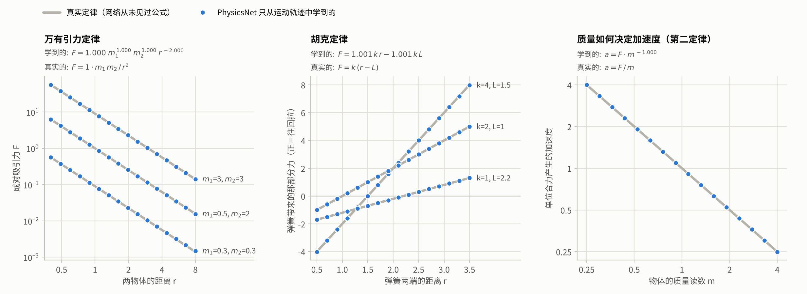
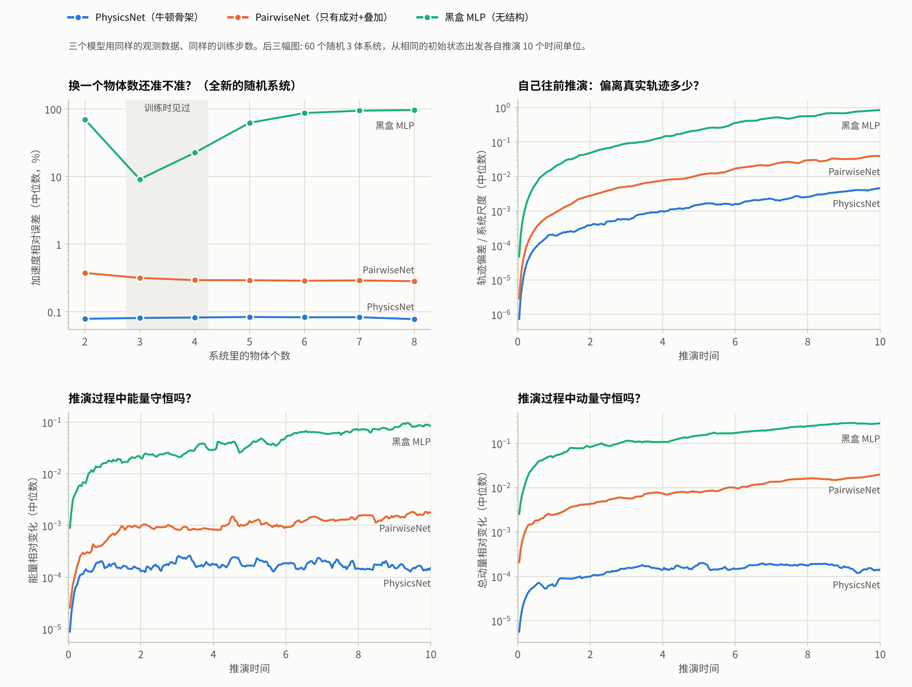
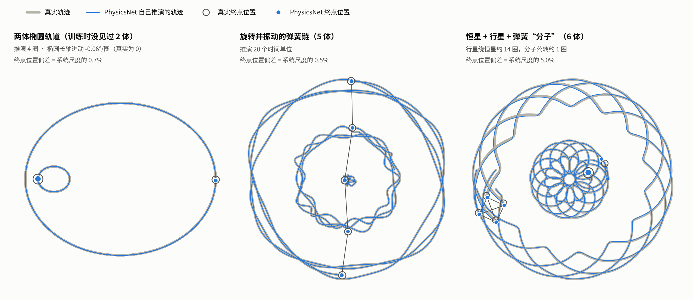

# PhysicsNet —— 让神经网络从观测中学出物理定律

目标是一个用来理解物理世界的神经网络。**当前阶段（v0）只覆盖牛顿力学**，
之后会逐步扩展到更多的物理。

一个二维质点"宇宙"按真实的牛顿力学运行（万有引力 + 弹簧）。神经网络看不到任何公式，
只能看到物体的位置随时间怎么变，以及每个物体的质量读数和每根弹簧的两个读数 (k, L)。
训练完以后，把网络学到的东西读出来，和真实定律逐项对比。

## 结果

**学到的定律**（在训练范围内对网络的输出做幂律 / 线性拟合）

| | 真实世界 | PhysicsNet 学到的 | 逐点偏差 |
|---|---|---|---|
| 万有引力 | F = 1 · m₁ m₂ / r² | F = 1.0004 · m₁^1.0000 · m₂^1.0000 · r^−2.0005 | 中位 0.06%，95 分位 0.46% |
| 胡克定律 | F = k (r − L) | F = 1.0011 k r − 1.0012 k L | RMS 0.42% |
| 质量与加速度 | a = F / m | a = F · m^−1.0000 | 最大 0.19% |

换两个随机种子重新训练，结果一致（r 的指数 −2.0010、−2.0003；m 的指数 1.0010、1.0001）。



**和两个对照模型比较**（同样的数据、同样的训练步数）

| 模型 | 内置的物理结构 | 加速度误差：3 体 / 8 体 | 推演 10 个时间单位后的轨迹偏差 | 能量变化 | 动量变化 |
|---|---|---|---|---|---|
| PhysicsNet | 牛顿骨架（见下） | 0.08% / 0.08% | 0.46% | 1.5e-4 | 1.4e-4 |
| PairwiseNet | 只有"成对 + 叠加" | 0.32% / 0.28% | 3.9% | 1.8e-3 | 2.0e-2 |
| 黑盒 MLP | 无 | 9.1% / 97% | 85% | 8.3e-2 | 2.8e-1 |

- 训练时只见过 3 体和 4 体系统；加速度误差是在 2–8 体的全新随机系统上测的（中位数）。
- 推演一栏：60 个随机 3 体系统，从同一初始状态出发让模型自己往前推，表中是中位数；
  轨迹偏差以系统尺度为单位。



**三个训练集中没有的场景**（PhysicsNet 自己推演，与真实轨迹叠在一起）



所有数字都在 `results/metrics.json` 里，由 `evaluate.py` 生成。

## 哪些是告诉它的，哪些是它学的

**目前写死在 PhysicsNet 结构里的（牛顿力学的骨架）**

1. 力是成对的；
2. 作用力与反作用力大小相等、方向相反，且沿两物体连线；
3. 力的大小只取决于两者的距离和属性，与绝对位置、朝向、速度无关；
4. 合力是各成对力的矢量和（叠加原理）；
5. 加速度 = 合力 ×（一个只和该物体质量读数有关的系数）。

**直接给它的读数**：每个物体的质量 m；每根弹簧的 (k, L)；各时刻的位置。
它不知道这些读数以什么方式起作用。

**它自己学出来的**：引力与两个质量各成正比、与距离平方成反比；弹簧的力对伸长量是线性的，
且与两端物体的质量无关；加速度与质量成反比（也就是引力里的质量和惯性里的质量是同一个量）。

**监督信号**只有一种：由相邻三帧位置做二阶差分得到的加速度。真实加速度只用于评估。

一个需要说明的自由度：把所有的力乘以常数 c、同时把所有惯性系数除以 c，运动完全不变，
所以力的整体单位无法从轨迹里确定。对比时固定了这一个常数，其余全部来自网络。

## 局限（如实）

- **观测没有噪声。** 二阶差分会把位置噪声放大约 1/Δt² 倍，真实数据上不能这样训练，
  需要改成多步推演的损失。
- **只在见过的范围内可靠**（距离 0.4–8，质量 0.25–4，劲度 0.5–4）。范围外的表现
  （模型值 / 真实值）：

  | 距离 r | 0.1 | 0.2 | 0.4–4 | 8 | 10 | 16 | 32 |
  |---|---|---|---|---|---|---|---|
  | 引力 | 0.88 | 0.99 | 1.00 | 0.98 | 0.94 | 0.79 | 0.38 |

  质量到 8 时引力偏大约 17%、惯性偏小约 22%；劲度到 8 时弹簧力偏大约 16%。
  也就是说网络学到的是范围内非常精确的"函数"，还不是可以任意外推的"公式"。
- **误差会累积。** 力的误差约 0.1%，但行星绕 14 圈后相位差约 0.28 弧度（6 体场景的
  终点偏差 5% 主要来自这里）。
- **随机多体系统的长时间测试有选择。** 引力很强，绝大多数随机系统几个时间单位内就会
  出现比 0.4 更近的交会，超出训练范围；推演测试只用了真实轨迹全程留在范围内的系统
  （3 体：1500 个候选里取前 60 个；4 体只测了 5 个时间单位）。
- **世界很小**：只有引力和弹簧两种力，没有碰撞、摩擦、约束、刚体、外场；只测了二维
  （模型代码本身不依赖维数）。
- 对照模型用普通线性输出。PhysicsNet 用的"幅度 × exp(指数)"输出也给它们试过，反而更差。

## 运行

```bash
pip install numpy torch matplotlib
python world.py            # 生成观测数据（约 4 分钟）
python train.py physicsnet     # 训练，CPU 单核约 10 分钟；另有 pairwise、mlp
python evaluate.py         # 读出定律、测试、画图（约 4 分钟）
```

已训练好的权重在 `checkpoints/`，数据生成后可以直接运行 `evaluate.py`。

| 文件 | 内容 |
|---|---|
| `world.py` | "真实世界"：物理定律、数值积分、随机场景、观测数据 |
| `model.py` | PhysicsNet 和两个对照模型 |
| `train.py` | 训练 |
| `evaluate.py` | 定律提取、泛化测试、长时间推演、三张图 |

训练数据：5000 个 3 体 + 5000 个 4 体随机系统，每个观测 3 个时间单位（Δt = 0.01），
共 221,716 个快照。PhysicsNet 35,747 个参数。单位是无量纲的（G = 1）。
